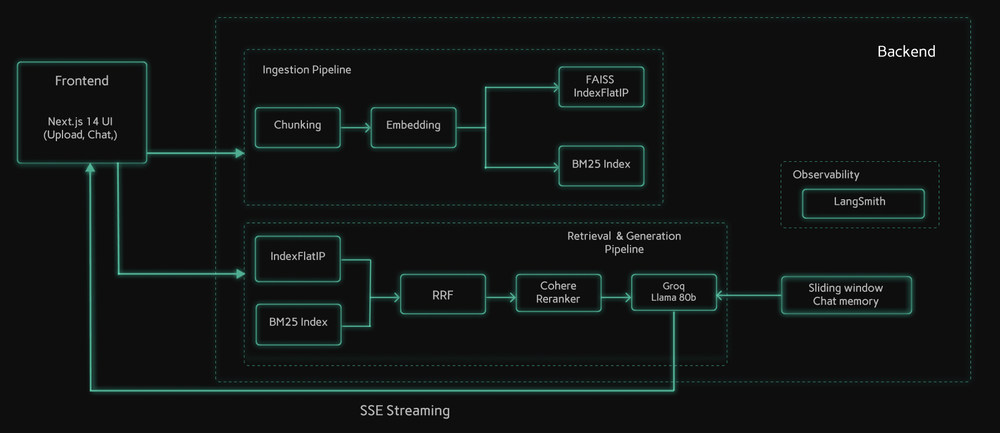

# Advanced Multi-Document Adaptive RAG Agent

## Table of Contents
- [Summary](#1-introduction)
- [Architecture diagram](#2-architecture-diagram)
- [Performance & Architecture Highlights](#3-performance--architecture-highlights)
- [Architecture Diagram](#4-architecture-diagram)
- [Features](#5-features)
- [Tech Stack](#6-tech-stack)
- [Project Structure](#7-project-structure)
- [Installation](#8-how-to-run-the-app)
- [Challenges I Faced](#9-challenges-faced--solutions)
- [Future Improvements](#10-future-improvements)

## 1. Introduction

A full stack question-answering system designed to retrieve and synthesize information from documents, featuring hybrid semantic/keyword search, dynamic fallback routing, and multilayered logic to ensure factually grounded responses.

Built with **Next.js 14**, **FastAPI**, and **Groq Llama 3**, the system implements a high-speed retrieval architecture combining **FAISS IndexFlatIP indexing** with **BM25 keyword search** using **Reciprocal Rank Fusion (RRF)**, **Cohere cross-encoder reranking**, and a smart dual-LLM fallback strategy.

Key capabilities include sentence-aware NLTK chunking, intelligent confidence gating to prevent hallucinations, sliding-window conversation memory, and end-to-end telemetry via LangSmith.

## 2. Architecture diagram



## 3. Performance & Architecture Highlights

This agent was engineered for extreme performance and reliability, achieving significant improvements through rigorous optimization, robust evaluation, and advanced architectural decisions.

### Performance Metrics:
*Validated through the comprehensive Ragas evaluation framework with 15 highly-complex baseline queries covering strict extraction and synthesization against the 'Attention Is All You Need' paper.*

| Metric | Score | What It Measures |
|---|---|---|
| **Faithfulness** | **0.891 (89.1%)** | Generated answers are strictly grounded in retrieved context chunks, heavily suppressing hallucinations. |
| **Answer Relevancy** | **0.880 (88.0%)** | Generated answers directly and concisely address the user's core intent. |
| **Context Precision** | **0.910 (91.0%)** | The most relevant document chunks are accurately ranked at the absolute top of the retrieval results context window. |
| **Context Recall** | **0.832 (83.2%)** | The retrieval system successfully finds the necessary information required to answer the truth. |

### Architectural Advancements

* **Dual-LLM Groq Strategy:** Deployed a highly-optimized setup using **Llama 3.3 70B** as the primary reasoning model and **Llama 3.1 8B** as an instantaneous automatic fallback model, ensuring unmatched speed (1000+ tokens/s) and near-100% API uptime resilience through dynamic error catching.

* **Hybrid Search with Reciprocal Rank Fusion:** Combined local **FAISS exact cosine search (semantic)** and **BM25 (keyword)** matching with **RRF (k=60)** fusion, drastically improving retrieval recall for both factual term-queries and contextual summaries.

* **Confidence Gating & Hallucination Prevention:** The generative LLM is structurally bypassed when retrieved RRF scores fall beneath an accepted threshold. Instead of hallucinating politely, the application firmly enforces an out-of-scope response logic.

* **Cross-Encoder Reranking:** Passed combined candidates through Cohere's dedicated multilingual reranker API, improving the precision logic formatting sent to the LLM generation prompt array.

* **Sentence-Aware NLP Chunking:** Ingested documentation chunks via PyMuPDF layered atop **NLTK sentence tokenization** over arbitrary character splitting, ensuring semantic boundaries never split mid-sentence, enabling much cleaner downstream local generic embeddings. 

## 4. Architecture Diagram

```text
                                       ┌─────────────────────────┐
                                       │     Next.js 14 UI       │
                                       │ (Upload, Chat, Sources) │
                                       └───────────┬─────────────┘
                                                   │
   ┌───────────────────────────────────────────────┴─────────────────────────────────────────┐
   │                                   FastAPI Backend                                       │
   │                                                                                         │
   │   ┌────────────────────────┐                             ┌────────────────────────┐     │
   │   │     1. INGESTION       │                             │      3. GENERATION     │     │
   │   │                        │                             │                        │     │
   │   │  ┌──────────────────┐  │                             │  ┌──────────────────┐  │     │
   │   │  │ PyMuPDF Parsing  │  │                             │  │  Sliding Window  │  │     │
   │   │  │ NLTK Chunking    │  │                             │  │  Memory (N=6)    │  │     │
   │   │  └────────┬─────────┘  │                             │  └────────┬─────────┘  │     │
   │   │           │            │                             │           │            │     │
   │   │  ┌────────▼─────────┐  │      ┌───────────────┐      │  ┌────────▼─────────┐  │     │
   │   │  │ all-MiniLM-L6-v2 │  │      │ 2. RETRIEVAL  │      │  │ Prompt Injection │  │     │
   │   │  │ Local Embeddings │  │      │               │      │  │ + Formatting     │  │     │
   │   │  └────────┬─────────┘  │      │               │      │  └────────┬─────────┘  │     │
   │   │           │            │      │               │      │           │            │     │
   │   │  ┌────────▼─────────┐  │      │               │      │  ┌────────▼─────────┐  │     │
   │   │  │FAISS IndexFlatIP │◄─┼──────┤ Hybrid Search ├──────┼─►│   Groq Llama 3   │  │     │
   │   │  │   + rank_bm25    │  │      │ + RRF Fusion  │      │  │  70B / 8B Stream │  │     │
   │   │  └──────────────────┘  │      │ + Cohere Rank │      │  └──────────────────┘  │     │
   │   └────────────────────────┘      └───────────────┘      └────────────────────────┘     │
   │                                                                                         │
   └───────────────────────────────────────────────┬─────────────────────────────────────────┘
                                                   │
                                     ┌─────────────▼─────────────┐
                                     │        LangSmith          │
                                     │ (Tracing & Observability) │
                                     └───────────────────────────┘
```

## 5. Features

### Core User Features

* **Instant Document Upload & Processing:** Upload structural PDFs rapidly with inline background status polling logic. 
* **Session Management & Isolation:** Persistent semantic context, document tracking, and conversation sliding-window history securely associated via localized frontend IDs with automated server eviction.
* **Advanced Hybrid Search:** Dual-mode retrieval combining semantic meaning and keyword precision.
* **Streaming Responses with Granular Citations:** Answers are generated and streamed via optimized Server-Sent Events (SSE), containing inline `(Page X)` markers, and populating expansive source panel arrays. 
* **Adaptive Error Handling:** Out-of-the-box UI/UX protections against scanned doc uploads, missing files, and unanswerable out-of-bounds questions context thresholds.

### Advanced Pipeline Features

* **Regex-Heuristics Metadata Extraction:** Dynamically predicts section headings, detects localized lists, and estimates table chunks natively without leaning entirely on expensive, slow pre-computation LLM calls.
* **Doc-Level One-Shot Groq Execution:** Leverages Llama 3 70B explicitly once during ingestion on the first 300 document characters to classify the global document title and topic passively.
* **Ragas Evaluator API Sandbox:** Includes a dedicated `/backend/evaluate_ragas.py` CLI module mapped to a golden standard 15-question set for local testing of context length windows safely beneath API execution quotas. 
* **LangSmith Instrumentation:** Granular nested `@traceable` python integration automatically analyzing prompt constructions, LLM latency, chunk retrievals, and Ragas metrics execution runs. 

## 6. Tech Stack

* **Frontend:** Next.js 14 App Router, React.js, TypeScript, Tailwind CSS, Pre-configured Syne Google Typography Design System
* **Backend:** Python 3.12, FastAPI, Uvicorn, Aiohttp 
* **Evaluation:** Ragas, Langchain-Groq, Pandas
* **LLMs:**
    * Reasoning: Groq API (Llama-3.3-70B-Versatile)
    * Fallback Generation: Groq API (Llama-3.1-8B-Instant)
* **Vector Database:** FAISS IndexFlatIP
* **AI/ML Components:**
    * Embeddings: `sentence-transformers/all-MiniLM-L6-v2` Local CPU Integration
    * Reranking: Cohere API
    * Hybrid Search: `rank_bm25` (BM25 keyword search + RRF k=60)
    * Document Processing: `PyMuPDF` (Fitz), `NLTK` 

## 7. Project Structure
```text
pdf-reader/
├── backend/
│   ├── main.py                  # FastAPI app + all integrated application routes
│   ├── config.py                # Validation environment configuration schema
│   ├── models.py                # Pydantic request/response typed models
│   ├── pipeline/
│   │   ├── ingestion.py         # PyMuPDF parse → chunk → embed → FAISS/BM25
│   │   ├── retrieval.py         # Query embedding → Hybrid Search → RRF → Cohere Rank
│   │   ├── generation.py        # System prompting → Groq Stream → Confidence bypasses
│   │   ├── memory.py            # Chat History (Sliding Window N=6)
│   │   └── session.py           # In-Memory stores + background task eviction TTL
│   ├── utils/
│   │   └── pdf_utils.py         # Scanned detection rules, content validation
│   ├── tests/                   # Base Python tests
│   ├── requirements.txt         # Project dependencies
│   └── evaluate_ragas.py        # Dedicated Ragas batch metric computation module
├── frontend/
│   ├── app/                     # Next.js Application Router Map
│   │   ├── globals.css          # Core Styling + Dark Theme properties
│   │   └── page.tsx             # Main view component (Upload vs Chat state switches)
│   ├── components/
│   │   ├── FileUpload.tsx       # Drag/Drop card handler
│   │   ├── UploadProgress.tsx   # SSE Polling Status Bar
│   │   ├── ChatWindow.tsx       # Message array mapping & rendering window
│   │   ├── MessageBubble.tsx    # Parsed LLM/User Markdown Chat UI elements
│   │   └── SourcePanel.tsx      # Retrieved source metadata chunk viewer
│   ├── hooks/
│   │   └── useChat.ts           # Advanced connection event + state logic
│   └── lib/
│       └── api.ts               # Local fetch request mapping API
├── ragas_scores.json            # Final Aggregated Evaluated RAG scores
├── ragas_results.csv            # Final Ragas DataFrame individual test cases
└── README.md                    # Project Architecture & Instructions File
```

## 8. How to Run the App

### Prerequisites
* Python 3.11+
* Node.js 18+
* An `.env` file within the `/backend` folder.

Rename `backend/.env.example` to `backend/.env` and inject your keys:
```env
GROQ_API_KEY=your_groq_api_key_here
HF_API_KEY=your_hf_api_key_here
COHERE_API_KEY=your_cohere_api_key_here
LANGCHAIN_API_KEY=your_langsmith_key_here
```

### Step 1: Clone & Setup
```bash
git clone <your-repo-link>
cd pdf-reader
```

### Step 2: Backend Setup
```bash
cd backend
python -m venv venv
source venv/bin/activate  # On Windows: venv\Scripts\activate

pip install -r requirements.txt

# Start the Backend Server process 
uvicorn main:app --reload --port 8000
```

### Step 3: Frontend Setup
```bash
cd frontend
npm install

# Start the Frontend Development Environment mapping onto port 3000
npm run dev
```
Access the application at http://localhost:3000

## 9. Challenges Faced & Solutions
This project navigated strict API limits, semantic challenges, and architecture complexities through iterative debugging:

- **Problem:** Scattered hallucinated answers deriving from implicit general knowledge logic whenever RAG queries missed target contexts. 
  **Solution:** Designed an internal **RRF confidence gate** architecture directly within the retrieval logic filtering system to entirely bypass LLM prompting calls locally in favor of structured out-of-context notifications.

- **Problem:** FAISS L2/Cosine semantic search missing precise ID/code matching questions entirely. 
  **Solution:** Assembled **BM25 token-matching indexes** natively merged with semantic searching using **Reciprocal Rank Fusion**.

- **Problem:** External Ragas framework APIs repeatedly triggering `429 Too Many Requests` on Llama model test iterations, blocking validation.
  **Solution:** Structured `evaluate_ragas.py` to leverage manual chunking sizes (350), restricted generated LLM limits (n=1, top_k=3), and hard `asyncio` batch pacing sleeps (65 seconds) directly matching standard quotas flawlessly. 

## 10. Future Improvements
* **Advanced Multi-Document Graph Context:** Implementing graph knowledge databases structure arrays natively within `FAISS Index` components enabling broad linking.
* **Persistent Document States via Postgres Vector:** Replacing the localized session state dependencies completely utilizing persistent vector stores such as Postgres/Supabase for continuous account integrations across devices.
* **Automated Web-Browsing Routing Fallbacks:** Providing real-time API integrations specifically restricted when confidence scores trip threshold caps natively instead of returning errors.
