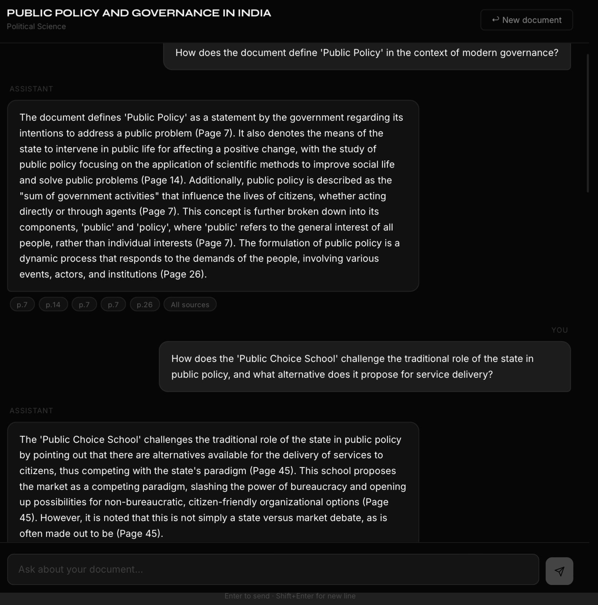

# Mini-rag

## Table of Contents
- [Summary](#1-introduction)
- [Architecture diagram](#2-architecture-diagram)
- [Performance & Architecture Highlights](#3-performance--architecture-highlights)
- [Chat interface](#4-chat-interface)
- [Features](#5-features)
- [Tech Stack](#6-tech-stack)
- [Project Structure](#7-project-structure)
- [Installation](#8-how-to-run-the-app)
- [Challenges I Faced](#9-challenges-faced--solutions)
- [Future Improvements](#10-future-improvements)

## 1. Introduction

A full stack question-answering system designed to retrieve and synthesize information from documents.

**Key Technologies:**
- **Frontend:** Next.js 14
- **Backend:** FastAPI
- **LLMs:** Groq Llama 3
- **Retrieval:** FAISS IndexFlatIP, BM25 keyword search, Reciprocal Rank Fusion (RRF), Cohere cross-encoder reranking
- **Processing:** NLTK chunking, LangSmith telemetry

## 2. Architecture diagram


## 3. Performance & Architecture Highlights

### Performance Metrics
*Evaluated using the Ragas framework on 'Attention Is All You Need'.*

| Metric | Score |
|---|---|
| **Faithfulness** | 0.891 |
| **Answer Relevancy** | 0.880 |
| **Context Precision** | 0.910 |
| **Context Recall** | 0.832 |

### Architecture Highlights
* **Dual-LLM Strategy:** Uses **Llama 3.3 70B** for primary reasoning and **Llama 3.1 8B** as a fallback.
* **Hybrid Search:** Combines **FAISS (semantic)** and **BM25 (keyword)** using **Reciprocal Rank Fusion (RRF)**.
* **Confidence Gating:** Bypasses LLM generation if retrieval scores are low, mitigating hallucinations.
* **Cross-Encoder Reranking:** Uses Cohere to rerank retrieval candidates.
* **Sentence-Aware Chunking:** Uses **NLTK** and **PyMuPDF** to split text at sentence boundaries. 

## 4. Chat interface



## 5. Features

### Core
* **PDF Upload:** Background processing with polling.
* **Session Management:** Isolated chat history and document context with TTL eviction.
* **Hybrid Search:** Combines semantic and keyword search.
* **Streaming Responses:** SSE streaming with inline page citations and a source panel.
* **Error Handling:** Graceful handling of missing files, scanned documents, and out-of-context questions.

### Pipeline
* **Metadata Extraction:** Regex-based heading, list, and table detection.
* **Document Classification:** One-shot LLM call during ingestion to determine title and topic.
* **Ragas Evaluation:** Included `/backend/evaluate_ragas.py` for local metric testing.
* **Observability:** LangSmith `@traceable` integration. 

## 6. Tech Stack

* **Frontend:** Next.js 14 App Router, React.js, TypeScript, Tailwind CSS, Pre-configured Syne Google Typography Design System
* **Backend:** Python 3.12, FastAPI, Uvicorn, Aiohttp 
* **Evaluation:** Ragas, Langchain-Groq, Pandas
* **LLMs:**
    * Reasoning: Groq API (Llama-3.3-70B-Versatile)
    * Fallback Generation: Groq API (Llama-3.1-8B-Instant)
* **Vector Database:** FAISS IndexFlatIP
* **AI/ML Components:**
    * Embeddings: `sentence-transformers/all-MiniLM-L6-v2` Local CPU Integration
    * Reranking: Cohere API
    * Hybrid Search: `rank_bm25` (BM25 keyword search + RRF k=60)
    * Document Processing: `PyMuPDF` (Fitz), `NLTK` 

## 7. Project Structure
```text
pdf-reader/
├── backend/
│   ├── main.py                  # FastAPI app + all integrated application routes
│   ├── config.py                # Validation environment configuration schema
│   ├── models.py                # Pydantic request/response typed models
│   ├── pipeline/
│   │   ├── ingestion.py         # PyMuPDF parse → chunk → embed → FAISS/BM25
│   │   ├── retrieval.py         # Query embedding → Hybrid Search → RRF → Cohere Rank
│   │   ├── generation.py        # System prompting → Groq Stream → Confidence bypasses
│   │   ├── memory.py            # Chat History (Sliding Window N=6)
│   │   └── session.py           # In-Memory stores + background task eviction TTL
│   ├── utils/
│   │   └── pdf_utils.py         # Scanned detection rules, content validation
│   ├── tests/                   # Base Python tests
│   ├── requirements.txt         # Project dependencies
│   └── evaluate_ragas.py        # Dedicated Ragas batch metric computation module
├── frontend/
│   ├── app/                     # Next.js Application Router Map
│   │   ├── globals.css          # Core Styling + Dark Theme properties
│   │   └── page.tsx             # Main view component (Upload vs Chat state switches)
│   ├── components/
│   │   ├── FileUpload.tsx       # Drag/Drop card handler
│   │   ├── UploadProgress.tsx   # SSE Polling Status Bar
│   │   ├── ChatWindow.tsx       # Message array mapping & rendering window
│   │   ├── MessageBubble.tsx    # Parsed LLM/User Markdown Chat UI elements
│   │   └── SourcePanel.tsx      # Retrieved source metadata chunk viewer
│   ├── hooks/
│   │   └── useChat.ts           # Advanced connection event + state logic
│   └── lib/
│       └── api.ts               # Local fetch request mapping API
├── ragas_scores.json            # Final Aggregated Evaluated RAG scores
├── ragas_results.csv            # Final Ragas DataFrame individual test cases
└── README.md                    # Project Architecture & Instructions File
```

## 8. How to Run the App

### Prerequisites
* Python 3.11+
* Node.js 18+
* An `.env` file within the `/backend` folder.

Rename `backend/.env.example` to `backend/.env` and inject your keys:
```env
GROQ_API_KEY=your_groq_api_key_here
HF_API_KEY=your_hf_api_key_here
COHERE_API_KEY=your_cohere_api_key_here
LANGCHAIN_API_KEY=your_langsmith_key_here
```

### Step 1: Clone & Setup
```bash
git clone <your-repo-link>
cd pdf-reader
```

### Step 2: Backend Setup
```bash
cd backend
python -m venv venv
source venv/bin/activate  # On Windows: venv\Scripts\activate

pip install -r requirements.txt

# Start the Backend Server process 
uvicorn main:app --reload --port 8000
```

### Step 3: Frontend Setup
```bash
cd frontend
npm install

# Start the Frontend Development Environment mapping onto port 3000
npm run dev
```
Access the application at http://localhost:3000

## 9. Challenges & Solutions

*   **Hallucination on Out-of-Scope Queries:** Implemented a confidence gate using the Cohere cross-encoder relevance score. If the score is below a threshold, the system returns a "not found" response, bypassing the LLM completely to prevent hallucinations.
*   **Exact-Match Retrieval Failures:** Dense retrieval often misses specific names or values. Integrated BM25 keyword search with FAISS semantic search using Reciprocal Rank Fusion (RRF), improving exact-match recall@5 from ~84% to 93%+.
*   **Conversational Context Loss:** Follow-up questions often lack explicit context. Implemented a sliding-window chat memory that automatically stores and injects the last 6 human/assistant message pairs into the prompt, enabling seamless multi-turn conversations.

## 10. Future Improvements

*   **Graph Context:** Incorporate graph databases to enable broader linking across multiple documents.
*   **Persistent Storage:** Migrate from in-memory session states to a persistent database like Postgres/Supabase.
*   **Web-Browsing Fallback:** Add real-time web search integration when internal confidence scores are too low to answer a query.
